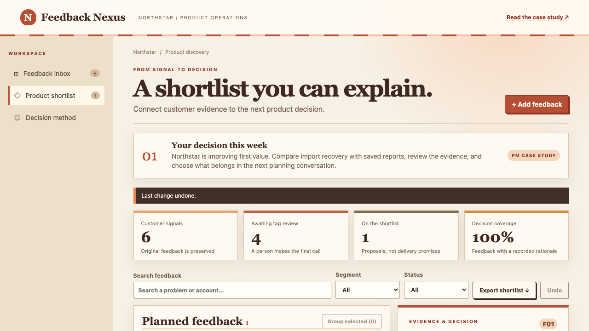

# Feedback Nexus — Product Management Case Study

Customer feedback is easy to collect and hard to turn into a defensible priority. This B2B SaaS product case study shows how I framed that problem, chose a deliberately constrained workflow, designed fictional sample evidence, and defined a way to evaluate it. The interactive prototype makes those product decisions reviewable.

**Reviewer route:** [Case study](docs/product/Case_Study.md) → [PRD and acceptance examples](docs/product/PRD.md) → [product decisions](docs/product/Product_Decisions.md) → [discovery and scoring plan](docs/product/Discovery_Plan.md) → [risks and prioritized investment](docs/product/Product_Risks.md). You can also [try the interactive demo](https://mvahedi2020.github.io/Feedback-Nexus/) or [watch the workflow](docs/media/workflow.webm).

## Try this decision

Northstar, a fictional operations platform, is improving first value. Compare import recovery with saved reports. Group F01 and F02, review the suggested tag, adjust effort, record your reasoning, and move a signal to Planned. Export the shortlist or undo your decision.

## My product role

I defined the opportunity framing, scope and prioritization choices, requirements, end-to-end workflow, fictional sample-data design, acceptance criteria, and evaluation plan. I chose to preserve source evidence, make the priority inputs inspectable, and offer a rationale for a planning-state change. This portfolio sample represents Product Manager ownership of the product work, not manual authorship of application code.

AI tools assisted with implementation and verification. This is a personal product case study, not a claim that I managed an engineering team.

## Product decisions

| Decision | Why | Tradeoff |
|---|---|---|
| Preserve original feedback when grouping | Keep evidence and account context | Grouping requires review |
| Show the formula and editable inputs | A reviewer can challenge the rationale | A score is directional, not a promise |
| Review simulated AI tags explicitly | Keep classification accountable | Adds a triage step |

## What works

Search, segment/status filters, manual submission, duplicate grouping, tag review, editable priority inputs, decision rationale, status changes, sample customer-update draft, browser persistence, undo, reset, and CSV shortlist export.

All accounts and feedback are fictional. Tags are simulated; no model or external customer system is connected. Changes stay in your browser. This project is independent of the other Northstar portfolio demonstrations. No measured customer outcomes or completed human research are claimed.

## Review the product work

- [Case study](docs/product/Case_Study.md)
- [Requirements and proposed success measures](docs/product/PRD.md)
- [Commercial hypotheses](docs/product/GTM_Strategy.md)
- [Implemented / next / later](docs/product/Sprint_Backlog.md)
- [Prototype validation](docs/product/Validation.md)
- [Exhaustive interaction and recovery matrix](docs/product/Control_Matrix.md)
- [Contributor setup](CONTRIBUTING.md)
